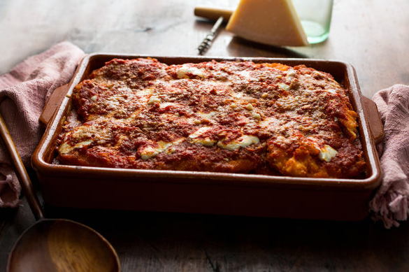

# Chicken Parmesan

## Ingredients

- chicken cutlets (`2/3 lbs`)
- all-purpose flour (`1/6 cup`)
- large eggs (`1`)
- panko bread crumbs (`1 cup`)
- kosher salt
- black pepper
- olive oil
- tomato sauce (`2 cups`)
- parmesan cheese, finely grated (`1/3 cup`)
- mozzarella, fresh (`1/6 lb`)

## Kitchen Tools

- baking pan
- kitchen mallet, or rolling pin
- parchment paper, or plastic wrap
- bowls (`3`)
- skillet
- stovetop
- paper towels
- plate

## Procedure

1. Coat cutlets
    - place cutlets between two pieces of parchment
    - using the kitchen mallet, pound meat to 1/4-inch-thick slices
    - place `flour` into `bowl 1`
    - place `eggs` into `bowl 2`
    - place `panko` into `bowl 3`
    - season `chicken cutlets` generously with `salt` and `pepper`
    - dip `chicken cutlets` into the flour bowl, then dip into egg bowl, then coat with panko.
        - repeat until all `chicken cutlets` are coated.

2. Fry cutlets
    - line plate with paper-towels
    - fill large skillet with `1/2 inch olive oil`
    - place over medium-high heat
    - when oil is hot, place `chicken cutlets` into oil, turning halfway through. 
        - `chicken cutlets` should be golden brown
        - transfer to paper-towel-lined plate.

3. Bake cutlets
    - pre-heat oven to `400`
    - tear `mozzarella` into bite-sized pieces
    - create layer 1
        - put thin layer of `tomato sauce` into baking pan
        - sprinkle `parmesan cheese` over sauce
        - place `1/2` of `chicken cutlets` over the `parmesan cheese`
    - create layer 2
        - top with `1/2` of `bite-sized mozzarella pieces`
        - top with `1/2` of remaining sauce
        - sprinkle with `1/3` of the parmesan
    - create layer 3
        - top with `1/2` of `bite-sized mozzarella pieces`
        - top with `1/2` of remaining sauce
        - sprinkle with the remaining `1/3` of the parmesan
    - put pan in oven and bake at `400` for `40 minutes`
        - _bake until cheese is golden and casserole is bubbling_
    - remove from oven
    - let cool for a `5` minutes

